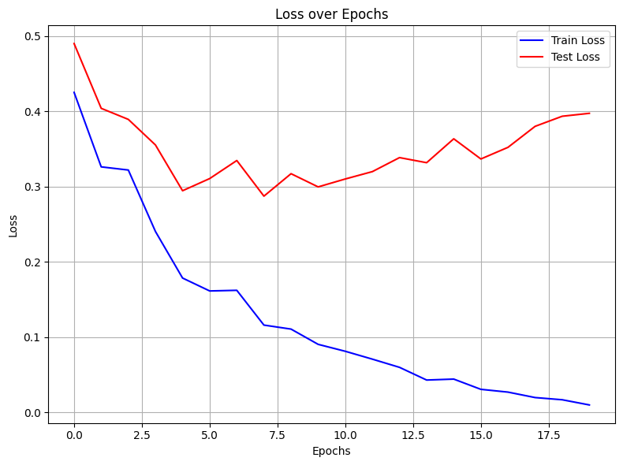
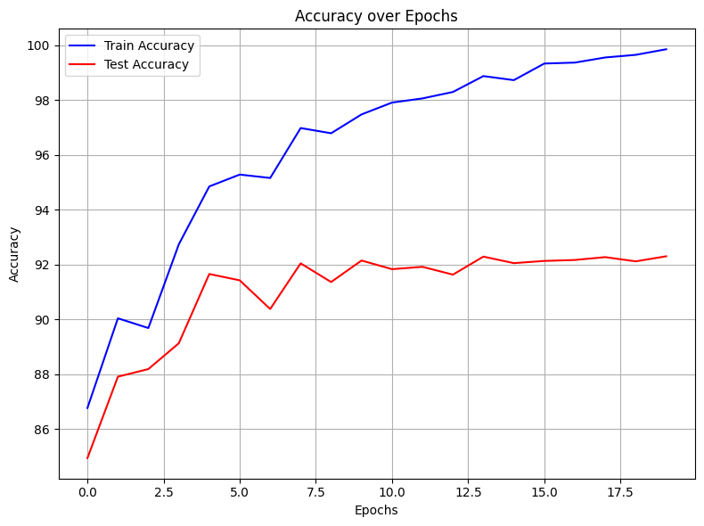
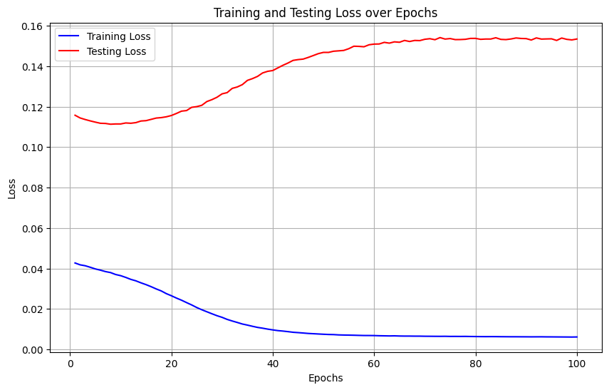
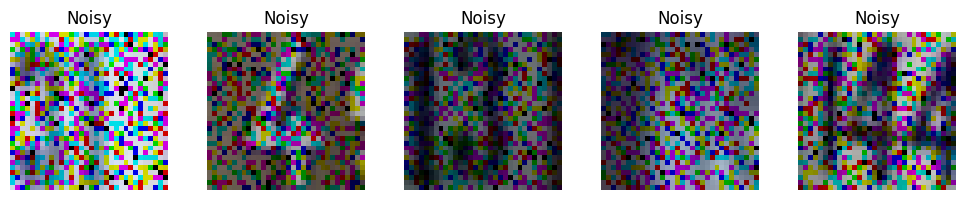
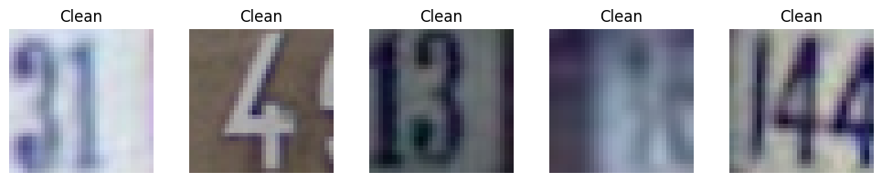

# Image Processing with Neural Networks

Short, practical project showcasing two computer vision tasks on the SVHN dataset using PyTorch:

- Classification: CNN that recognizes digits (0–9) from 32×32 RGB images
- Denoising: Lightweight CNN that maps noisy images to clean originals

## Features
- SVHN data loading with `torchvision`
- Image grid visualization utilities
- CNN architectures for classification and denoising
- Training, evaluation, and metric plotting (loss/accuracy)

## Project Structure
- `F24_4ML3_Assignment_4.ipynb`: Main notebook with end‑to‑end workflows
- `data/`: Auto‑downloaded SVHN dataset (handled by `torchvision`)

## Start
1. Open `main.ipynb` in VS Code or Jupyter.
2. Run cells in order:
	- Load SVHN and visualize samples
	- Train and evaluate the classification CNN
	- Build, train, and visualize the denoising CNN results
3. Plots for loss/accuracy and image grids are rendered inline.

## Notes
- The notebook auto‑downloads SVHN (`split=train/test`).
- GPU is used if available; otherwise falls back to CPU.
- Hyperparameters (batch size, epochs, learning rate) are defined in cells and can be adjusted.

## Citation
SVHN Dataset: http://ufldl.stanford.edu/housenumbers/

## Results
### Model's Loss over Epochs

### Model's Accuracy over Epochs

### Model's Training and Testing Loss over Epochs

### Denoising over data

